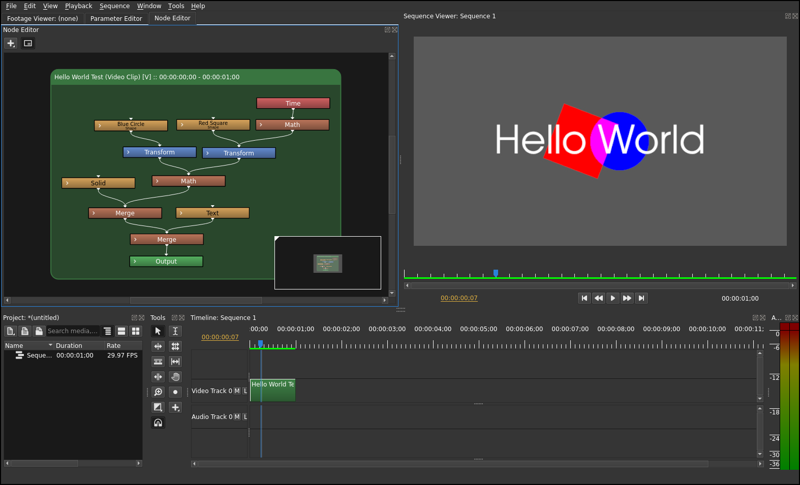

# olivenodes

`olivenodes` is a Python package for programmatically generating a
directed acyclic graph of effect nodes that can be imported into the
[Olive video editor](https://olivevideoeditor.org/) as XML.

For example, the following code builds a node graph and prints it as XML: 

```python
from olivenodes import Graph, ClipNode, ShapeNode, SolidNode, TextNode, TimeNode

graph = Graph()

# Create leaf nodes

t = TimeNode(graph)

solid = SolidNode(graph, color=(0.1, 0.1, 0.1))

square = ShapeNode(graph, "Red Square",
                   size=(300, 300)).transform(pos=(-100, 0), rot=t*90)
                   
circle = ShapeNode(graph, "Blue Circle",
                   type=ShapeNode.Circle, size=(300, 300),
                   color=(0, 0, 1)).transform(pos=(100, 0))
                   
text = TextNode(graph, text="Hello World", size=(1100, 300), pos=(0, 35),
                       font_size=200, valign=TextNode.Center)

# Combine textures (link nodes via new Math and Merge nodes)
root = solid | (square + circle) | text

# As-is, XML will represent loose nodes for pasting into the Node Editor
# Add a Clip node to paste as a single clip into the Timeline
clip = ClipNode(graph, "Hello World Test", buffer=root, length="30/30")

# Node parameters can be viewed and/or edited after node creation
text["font"] = "URW Gothic [UKWN]"

print(graph.to_xml())
```

Pasting the resulting XML into the Olive Timeline window yields:
       
[](doc/OliveNodesScreenshot.png)
